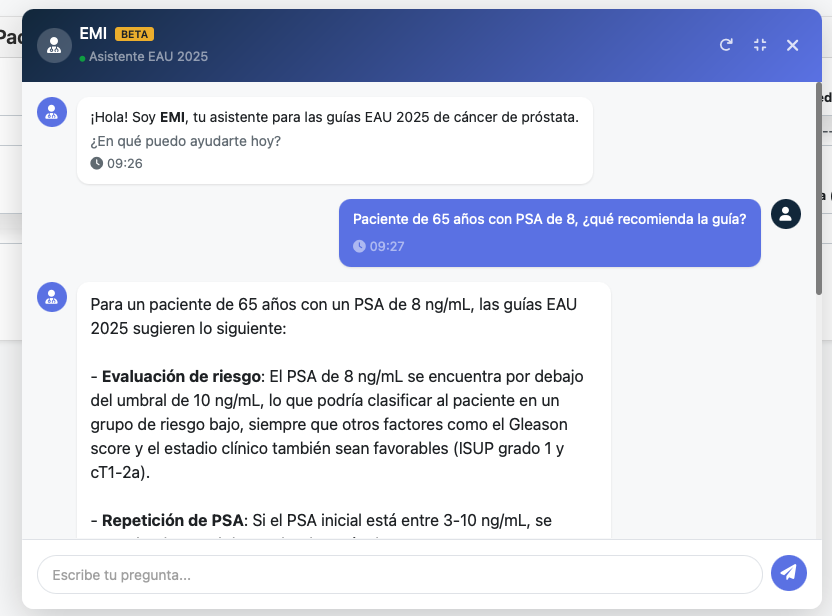
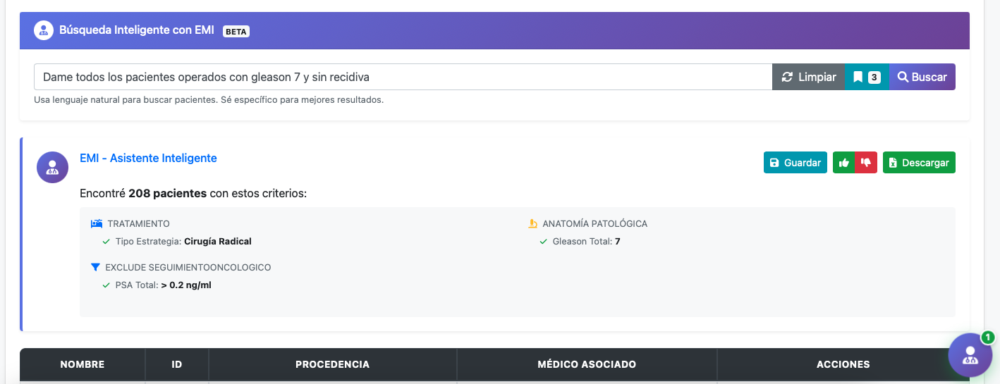
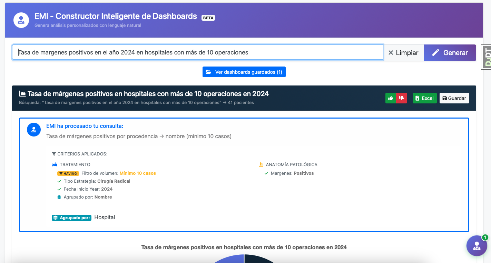

# 📌 Resumen

Plataforma internacional de gestión médica especializada en urología con inteligencia artificial integrada. Actualmente operando en España, Chile, México, Brasil y otros países, gestionando +10.000 pacientes en 40 hospitales incluido el prestigioso Instituto Valenciano de Oncología (IVO).
La plataforma combina gestión clínica tradicional con IA avanzada: chatbot médico entrenado con las guías EAU 2025, búsqueda inteligente en lenguaje natural y constructor automático de dashboards.

# 🎯 Objetivo

Sistema diseñado para revolucionar la gestión de datos urológicos mediante:

✅ IA Médica Especializada: Asistente virtual con conocimiento de guías EAU 2025 actualizado

✅ Búsqueda Inteligente: Consultas en lenguaje natural sobre miles de registros médicos

✅ Dashboards Automáticos: Generación instantánea de visualizaciones estadísticas complejas

✅ Seguridad Médica: Encriptación avanzada y cumplimiento normativo internacional

✅ Multi-tenant: Aislamiento completo de datos entre instituciones

✅ Análisis Predictivo: Algoritmos propios para apoyo en decisiones clínicas

✅ Interoperabilidad: Exportación en múltiples formatos (CSV, Excel, HL7)

# 🔍 Problema Inicial

Los servicios de urología enfrentaban:

🔴 Datos fragmentados en Excel, papel y sistemas incompatibles

🔴 50% del tiempo en tareas administrativas vs atención al paciente

🔴 Decisiones sin data: Falta de métricas para protocolos basados en evidencia

🔴 Búsquedas imposibles: Semanas para encontrar pacientes con criterios específicos

🔴 Reportes manuales: Días creando estadísticas para publicaciones

🔴 Guías desactualizadas: Consulta manual de protocolos EAU en PDFs de 500+ páginas

# 🚀 Solución Desarrollada

**Stack Tecnológico**

Backend:     Django 5.0, PostgreSQL, Redis

Frontend:    React, TypeScript, Bootstrap

IA:          OpenAI API, RAG, Embeddings, LangChain

Seguridad:   JWT, Encriptación AES-256, 2FA

DevOps:      Docker, AWS, GitHub Actions

Analytics:   Pandas, NumPy, Chart.js

**🤖 EMI - Asistente Inteligente EAU 2025**

Chatbot médico entrenado con las guías europeas de urología más recientes:

Capacidades:

Respuestas basadas en evidencia de guías EAU 2025

Contextualización según edad, PSA, Gleason, estadio clínico

Recomendaciones de tratamiento personalizadas

Cita fuentes y niveles de evidencia

**🔍 Búsqueda Inteligente con IA**

Sistema de búsqueda en lenguaje natural sobre toda la base de datos:

Ejemplo real: "Dame todos los pacientes operados con gleason 7 y sin recidiva"

EMI automáticamente:

Interpreta la consulta natural

Traduce a criterios médicos (Cirugía Radical, Gleason 7, PSA >0.2)

Encuentra 208 pacientes en <2 segundos

Permite exportación inmediata a Excel/CSV

**📊 Constructor Inteligente de Dashboards**

Generación automática de visualizaciones estadísticas complejas:

Ejemplo: "Tasa de márgenes positivos en el año 2024 en hospitales con más de 10 operaciones"

El sistema:

Comprende consultas estadísticas complejas

Aplica filtros y agrupaciones automáticamente

Genera gráficos interactivos al instante

Exporta a Excel con un click

Guarda dashboards para reutilización

🔐 Seguridad y Cumplimiento

✅ Encriptación AES-256 en reposo y tránsito

✅ Cumplimiento GDPR y normativas locales de cada país

✅ Auditoría completa de accesos y modificaciones

✅ Backup automático cada 24 horas con retención 90 días

✅ Multi-factor authentication obligatorio para usuarios

✅ Aislamiento de datos por hospital/país (multi-tenant)

# 📊 Resultados e Impacto

**Métricas de Éxito**

Pacientes gestionados:        +10.000

Hospitales activos:           40 (incluido IVO)

Países:                       España, Chile, México, Brasil

Usuarios concurrentes:        70+ médicos

Consultas IA/día:            50+

Reducción tiempo admin:       -60%

Satisfacción usuarios:        4.8/5

Uptime:                      99.9%

**Beneficios Medibles**

✅ 60% reducción en tiempo administrativo

✅ De 3 días a 5 minutos para generar reportes de investigación

✅ 100% disponibilidad de guías actualizadas vía EMI

✅ De semanas a segundos para búsquedas de cohortes

✅ 30% mejora en adherencia a protocolos EAU

✅ ROI positivo en 6 meses para hospitales

# 💡 Lecciones Aprendidas

**Técnicas**

RAG + Embeddings perfectos para consultas médicas específicas

Caché agresivo esencial con consultas complejas a PostgreSQL

Arquitectura multi-tenant desde día 1 facilita expansión internacional

Tests end-to-end críticos en software médico

**Producto**

Los médicos quieren simplicidad, no más funcionalidades

El lenguaje natural elimina barreras de adopción

Dashboards automáticos son el feature más valorado

La IA debe citar fuentes para generar confianza médica

**Negocio**

Empezar con un país y validar antes de internacionalizar

El IVO como cliente abrió puertas en toda España

Precio por usuario funciona mejor que por hospital

Soporte 24/7 no es negociable en salud

# 🎯 Conclusión

UroData ha transformado la gestión urológica en 4 países, permitiendo a los médicos reducir 60% el tiempo administrativo y tomar decisiones basadas en evidencia con apoyo de IA.
La combinación de gestión clínica tradicional con IA aplicada (chatbot médico, búsqueda inteligente, dashboards automáticos) posiciona a UroData como líder en healthtech para urología en el mercado hispanohablante.

